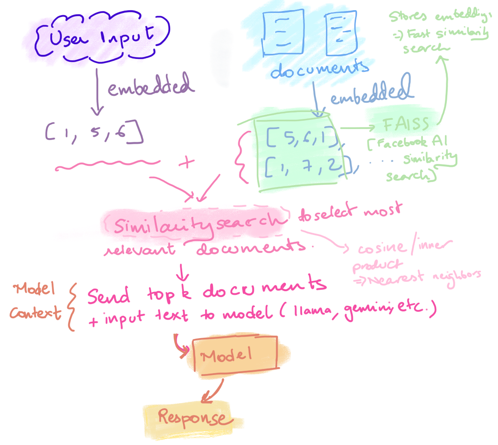

# How Apps That Use AI Work

Figure: Michelle's Understanding of An AI app

## App Workflow

1. **User Input**
   - The user enters some text (a query).

2. **Create Embedding**
   - The app generates an **embedding** (vector representation) of the input text.

3. **Document Embeddings**
   - Pre-computed embeddings of documents are already stored.

4. **Similarity Search (using FAISS)**
   - The app compares the input vector with the stored document vectors to find the most relevant ones.

5. **Select Top Documents**
   - The most relevant documents (highest similarity scores) are selected.

6. **The Model**
   - The query + selected documents are sent to the model (llama, gemini, or whatever model you pick).
   - The model uses these documents as *context* to generate an answer.

7. **Final Answer**
   - The model outputs the answer, which is shown to the user.

---

## What is FAISS?

FAISS (**Facebook AI Similarity Search**) is an open-source library built by Meta for **fast vector similarity search**.

### Why FAISS is Useful

- **Efficient storage** of embeddings in a special index.  
- **Fast similarity search** – finds nearest neighbors in milliseconds.  
- **Scales to millions of vectors** – handles very large datasets.  
- **Supports multiple similarity metrics** – cosine similarity, Euclidean distance, inner product.  
- **Integrates with LangChain easily** – works as a vector store backend.

### Analogy

Without FAISS: You’d check every book in a library manually to see if it’s relevant.  
With FAISS: You have a smart librarian who instantly pulls out the top 3–5 most relevant books.

---

## Summary

- Your app uses **embeddings** to represent both queries and documents.  
- **FAISS** performs the similarity search to quickly retrieve the most relevant documents.
