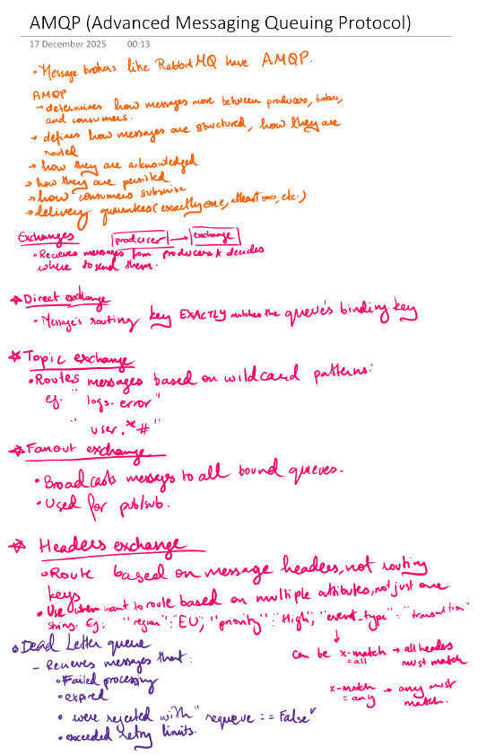

# Rabbit MQ

Basically a queue that follows AMQP (Advanced Messaging Queuing Protocol). Good for when you want to run a task in the background.

## AMQP

## Rabbit MQ

<embed src="images/rabbit_mq.pdf#toolbar=0&navpanes=0&scrollbar=0" type="application/pdf" width="100%" height="600px" />